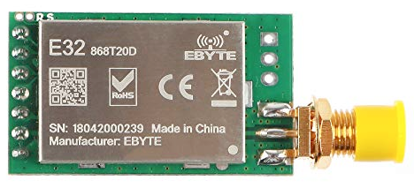
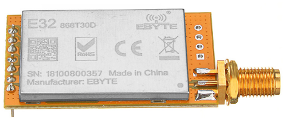

# STM8L151G6-based LoRaWAN node

    This is alternative firmware for E32-868T20D and E32-868T30D LoRa UART modules,
that by default works in proprietary p2p mode. The alternative firmware allows to
use them as node in LoRa WAN networks, like TheThingNetwork or others in both
OTAA or ADR modes.

 |  |  |
 |--- |--- |
 | E32-868T20D 100mW module (witout LNA and PA) | E32-868T30D 1W module including LNA and PA |


# This firmware includes such features:
  * Supports LoRa MAC mode A with OTAA or ADR modes.
  * UART pins used for configuring device or getting status info.
  * Configure device by pulling down M0 pin by 10 seconds during start (or initial run).
  * DevEUI can be auto-generated from device's unique ID values.
  * Data push interval - is configurabe (in minutes) during configuration.
  * Reception of data acknowledgement from the network can be disabled during configuration.
  * Sends battery supply voltage as sensor value (real supply values are for 3.3 V or lower).
  * Low-power sleep mode during inactivity with disabling internal TCXO and LoRa modem.
  * Can be used as "door opening" or motion sensor node, due raising of digital input -
    activate sending updated information to the network.
  * Can be configured to disable UART and use that free pins as additional digital inputs.
  * Supports BMP180 or BME280 sensors in I2C mode by using M0 - as SCL and M1 as SDA pins.
  * Additional I2C sensor power supply can be completely disabled during sleep mode
    (for power saving) when it's supply is connected to the LoRa modem TCXO power switch.
    This easier for E32-868T30D due connecting to that switch is not require opening the schield).


# Builded firmware info
Size:
```
  28 527 bytes of readonly  code memory
   3 526 bytes of readonly  data memory
     907 bytes of readwrite data memory
```


# Example of configuration mode (when M0 pin is connected to the GND during 10 seconds):
```
=============CONFIGURATION MODE==============
Waiting for release of M0 pin...
=============================================
Please enter required data to register device
in LoRa network. All values - are MSB first,
just like it shown in TTN console.
=============================================
Disable OTAA activation method (y/N):n
OTAA is: ENABLED
AppEUI:488b3b488d359722
[16]: 48 8B 3B 48 8D 35 97 22 
AppKEY:89c6e8c997ffff4885c075a9488b1df5
[32]: 89 C6 E8 C9 97 FF FF 48 85 C0 75 A9 48 8B 1D f5 
DevEUI[press enter for default: A9 21 00 48 8D 15 09 24 ]:
[0]: A9 21 00 48 8D 15 09 24 
Statistics data push interval (in minutes)
[default: 1, max: 65535]:5
Statistics collection interval: 5 minutes
Receive confirmation (ACKnowledgement) from gateways (Y/n):y
ACK is: ENABLED
Disable UART pins and use them as additional input GPIO's
for digital sensors (y/N):n
UART is: ENABLED
=============CONFIGURATION FINISHED==============
```

# Licensing
    Software is licensed under Eclipse Public License - v 2.0. Some AES code - is under LGPL.
